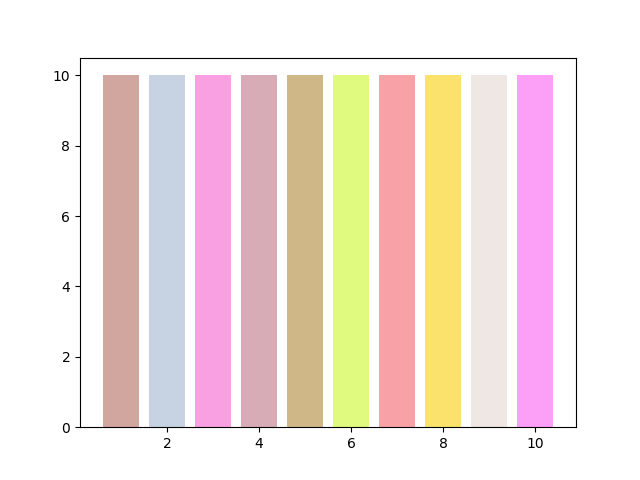

# Pastel_Color_Generator
Python scripts that generates a list of Pastel colors in a hexa codes. 
Output of the script is a text file and a png file with shown colors in the same order as in the text file.
## Usage example
Pastel_color_generator.py -n 10

